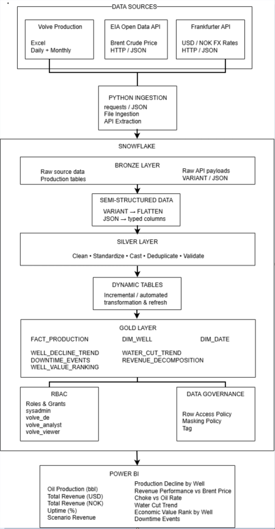

# Volve Oil & Gas Data Platform

An end-to-end oil & gas data platform and analytics project built with **Snowflake, Python, REST APIs, JSON, Dynamic Tables, SQL, and Power BI**.

This project demonstrates how publicly available oil & gas production data and external market data can be ingested, transformed, governed, modelled, and served as an analytical data platform.

The project uses historical **Volve field production data**, **Brent crude oil benchmark prices from the U.S. Energy Information Administration (EIA) Open Data API**, and **USD/NOK foreign exchange rates from the Frankfurter API**.

---

## Project Overview

The central business question addressed by this project is:

> **How does well-level oil production performance change over time, and what is the indicative production value when external crude-oil market prices are applied?**

The project simulates an oil & gas production analytics platform from source ingestion through to business intelligence.

The overall workflow is:

```text
Source Data
    ↓
Python / REST API Ingestion
    ↓
Snowflake Bronze
    ↓
Snowflake VARIANT / JSON Processing
    ↓
Silver Transformation
    ↓
Dynamic Tables
    ↓
Gold Analytical Model
    ↓
Power BI
```

The project demonstrates both **data engineering** and **analytics engineering** concepts in an oil & gas context.

---

# Business Objectives

## Production & Reservoir Analysis

### 1. Production Decline

**Question:**

> How does oil, gas, and water production change over time at well level and field level?

The analysis examines:

- Oil production trends
- Gas production trends
- Water production trends
- Well-level production trajectories
- Field-wide production trends
- Production decline patterns

This provides a simplified production decline analysis and demonstrates time-series analysis using real historical production data.

---

### 2. Water Cut

**Question:**

> Which wells show increasing water cut over time?

Water cut is calculated as:

```text
Water Cut =
Water Production
-----------------------------
Oil Production + Water Production
```

Increasing water cut can indicate changing well or reservoir behaviour.

The analysis identifies wells where water contribution increases relative to total liquid production.

---

### 3. Choke and Wellhead Performance

**Question:**

> Is there an observable relationship between choke size, wellhead pressure, and oil production rate?

The project combines operational measurements with production data to investigate:

- Choke size
- Wellhead pressure
- Oil production rate

This demonstrates how operational variables can be analysed alongside production outcomes.

---

### 4. Downtime and Shut-ins

**Question:**

> How much production was associated with downtime or shut-in periods?

The analysis examines:

- Shut-in days
- Downtime events
- Downtime duration
- Production impact
- Temporal patterns

The project only uses classifications that are supported by the source data and does not infer planned or unplanned causes where such information is unavailable.

---

# Economic Analysis

## 5. Indicative Production Value

**Question:**

> What is the estimated notional production value when historical Brent benchmark prices are applied to oil production?

The basic calculation is:

```text
Indicative Production Value
=
Oil Production Volume × Brent Benchmark Price
```

For example:

```text
1,000 bbl × $70/bbl
=
$70,000 indicative value
```

This is **not realized company revenue**.

The calculation does not account for:

- Crude quality differentials
- Transportation costs
- Royalties
- Taxes
- Operating expenditure
- Marketing costs
- Contractual pricing
- Realized sales prices

Therefore, the project uses the term **indicative production value** rather than actual revenue.

---

## 6. Well Value Contribution

**Question:**

> Which wells contribute the greatest cumulative indicative production value?

The analysis ranks wells based on cumulative indicative production value.

This supports:

- Well ranking
- Contribution analysis
- Pareto analysis
- Concentration analysis

---

## 7. Price vs Volume

**Question:**

> How much of the change in indicative production value is associated with production volume versus benchmark price?

The project decomposes changes in indicative value into:

```text
Production Volume Effect
+
Price Effect
```

This helps distinguish operational production effects from commodity-market effects.

---

## 8. Brent Price Scenario Analysis

**Question:**

> How would indicative field value change under different Brent price assumptions?

Example scenarios include:

```text
$50/bbl
$70/bbl
$90/bbl
```

Power BI What-If parameters are used to allow interactive price-sensitivity analysis.

---

# Data Sources

The project integrates three main data sources.

## Volve Production Data

Historical Volve field production and operational data.

The source workbook contains daily and monthly production worksheets.

The dataset is used for:

- Oil production
- Gas production
- Water production
- Well-level analysis
- Production decline
- Water cut
- Choke analysis
- Wellhead pressure analysis
- Downtime analysis

The original source dataset is not redistributed in this repository.

---

## EIA Brent Crude Oil Prices

Historical Brent crude oil benchmark prices are retrieved through the **U.S. Energy Information Administration Open Data API**.

The API returns nested JSON data.

The raw API response is stored in Snowflake using the `VARIANT` data type before being transformed into relational columns.

The processing pattern is:

```text
EIA REST API
    ↓
JSON Response
    ↓
Python
    ↓
Snowflake Bronze
    ↓
VARIANT
    ↓
LATERAL FLATTEN
    ↓
Typed Relational Columns
```

---

## USD/NOK Foreign Exchange Rates

Historical USD/NOK exchange rates are retrieved using the Frankfurter API.

The FX dataset demonstrates how a second external API can be integrated into the same analytical platform.

---

# Architecture



The platform follows a layered architecture:

```text
SOURCE
   ↓
INGESTION
   ↓
BRONZE
   ↓
SILVER
   ↓
DYNAMIC TABLES
   ↓
GOLD
   ↓
POWER BI
```

Detailed architecture documentation is available in:

- `architecture/README.md`
- `docs/methodology.md`

---

# Snowflake Data Architecture

## Bronze Layer

The Bronze layer preserves source data in a relatively raw form.

It contains:

- Raw production data
- Raw Brent API payloads
- Raw FX API payloads

For semi-structured API data, the raw JSON payload is stored in a Snowflake `VARIANT` column.

---

## Silver Layer

The Silver layer standardizes and cleans source data.

Typical transformations include:

- Data-type conversion
- Date standardization
- Column standardization
- Null handling
- Duplicate handling
- Business-rule transformations
- Data validation
- Joining related datasets

---

## Dynamic Tables

Snowflake Dynamic Tables are used in the transformation layer to demonstrate declarative data transformation and automatic maintenance of derived datasets.

The Dynamic Tables sit between the transformed Silver data and analytical Gold datasets.

```text
Silver
   ↓
Dynamic Tables
   ↓
Gold
```

---

## Gold Layer

The Gold layer contains analytical datasets designed for Power BI consumption.

The main Gold objects are:

```text
FACT_PRODUCTION
DIM_WELL
DIM_DATE
WELL_DECLINE_TREND
WATER_CUT_TREND
DOWNTIME_EVENTS
REVENUE_DECOMPOSITION
WELL_VALUE_RANKING
```

---

# Semi-Structured Data Processing

The EIA API provides nested JSON.

The project demonstrates how Snowflake can store and process this data without requiring immediate flattening outside the data warehouse.

Example transformation:

```sql
SELECT 
    f.value:period::DATE AS price_date,
    f.value:value::FLOAT AS brent_usd_bbl,
    f.value:"series-description"::STRING AS series_desc,
    f.value:units::STRING AS units
FROM BRONZE.BRENT_RAW,
LATERAL FLATTEN(
    input => raw_payload:response:data
) f;
```

This demonstrates:

- `VARIANT`
- JSON path expressions
- `LATERAL FLATTEN`
- Semi-structured data
- Type casting
- Relational transformation

---

# Dimensional Modelling

The analytical layer uses a **Star Schema** approach.


The central fact table is:

```text
FACT_PRODUCTION
```

with supporting dimensions:

```text
DIM_WELL
DIM_DATE
```

Additional analytical tables are derived from the core production and market datasets.

---

## FACT_PRODUCTION

Contains measurable production observations.

Typical measures include:

- Oil volume
- Gas volume
- Water volume
- Production days
- Shut-in indicators
- Choke measurements
- Wellhead pressure

---

## DIM_WELL

Contains descriptive well-level attributes.

This dimension allows production metrics to be analysed by well and well characteristics.

---

## DIM_DATE

Provides a standard date dimension for time-series analysis.

It supports:

- Year
- Quarter
- Month
- Date
- Time-based filtering
- Time-based aggregation

---

# Analytical Gold Tables

## WELL_DECLINE_TREND

Supports:

- Oil production decline
- Gas production trends
- Water production trends
- Well-level production trajectories
- Field-wide production analysis

---

## WATER_CUT_TREND

Supports:

- Water-cut trends
- Well comparisons
- Increasing water contribution
- Potential water breakthrough indicators

---

## DOWNTIME_EVENTS

Supports:

- Shut-in analysis
- Downtime duration
- Operational interruptions
- Production impact

---

## REVENUE_DECOMPOSITION

Supports:

- Indicative production value
- Brent price effects
- Production-volume effects
- Price-volume analysis

The term "revenue" is used as an analytical model name and does not represent realized company revenue.

---

## WELL_VALUE_RANKING

Supports:

- Well ranking
- Cumulative indicative value
- Contribution analysis
- Pareto-style analysis
- Concentration analysis

---

# Snowflake Governance

The project demonstrates Snowflake Role-Based Access Control.

The role hierarchy is:

```text
SYSADMIN
    ↓
TB_ADMIN
    ↓
TB_DATA_ENGINEER
    ├── TB_DEV
    └── TB_ANALYST
```

The project demonstrates:

- Custom roles
- Role hierarchy
- Database privileges
- Schema privileges
- Object-level privileges
- Role inheritance
- Least-privilege concepts

Governance SQL is available under:

```text
snowflake/sql/
```

---

# Python and API Ingestion

Python is used to retrieve external API data.

The ingestion scripts demonstrate:

- REST API requests
- HTTP status handling
- Query parameters
- JSON responses
- Environment variables
- Raw JSON persistence
- Error handling

The general workflow is:

```text
Python
   ↓
requests.get()
   ↓
REST API
   ↓
HTTP Response
   ↓
response.json()
   ↓
Python Object
   ↓
Raw JSON File
```

---

# Snowflake Python / pandas Profiling

An additional Snowflake Python exercise was developed to profile Bronze data using pandas.

The profiling exercise demonstrates:

- Snowflake Python
- pandas
- DataFrame operations
- Null analysis
- Data type inspection
- Descriptive statistics
- Basic data-quality profiling

This component is primarily a learning exercise and is separate from the core transformation pipeline.

The implementation is available under:

```text
snowflake/python/
```

---

# Data Quality

Data quality is considered throughout the pipeline.

The project examines:

- Completeness
- Validity
- Uniqueness
- Temporal consistency
- Referential integrity
- Missing values
- Duplicate records
- Production-value validity
- Market-price alignment

The general approach is:

```text
Profile
   ↓
Validate
   ↓
Transform
   ↓
Validate Again
   ↓
Gold
```

Detailed documentation is available in:

```text
docs/data_quality.md
```

---

# Power BI Dashboard


Power BI connects to the Snowflake Gold layer.

The dashboard brings together:

- Production
- Reservoir indicators
- Operational performance
- Indicative economics

---

## Production Analysis

The dashboard provides:

- Oil production
- Gas production
- Water production
- Field production trends
- Well production trends
- Production decline

---

## Water Cut Analysis

The dashboard provides:

- Water-cut trends
- Well comparisons
- Increasing water-cut indicators
- High-water-cut wells

---

## Operational Analysis

The dashboard provides:

- Choke size
- Wellhead pressure
- Oil production rate
- Shut-in days
- Downtime events

---

## Economic Analysis

The dashboard provides:

- Brent benchmark price
- Indicative production value
- Production volume
- Price-volume decomposition
- Well value ranking

---

## Scenario Analysis

The Power BI What-If parameter allows the user to change the assumed Brent price.

Example scenarios:

```text
$50/bbl
$70/bbl
$90/bbl
```

This provides an interactive sensitivity-analysis feature.

---

# Repository Structure

```text
volve-snowflake-data-platform/
│
├── README.md
│
├── architecture/
│   ├── README.md
│   ├── data_pipeline.png
│   └── data_model.png
│
├── data/
│   └── README.md
│
├── docs/
│   ├── data_sources.md
│   ├── methodology.md
│   └── data_quality.md
│
├── powerbi/
│   ├── README.md
│   └── dashboard.png
│
├── python/
│   ├── README.md
│   ├── eia_api.py
│   ├── fx_api.py
│   └── requirements.txt
│
└── snowflake/
    ├── README.md
    │
    ├── sql/
    │   ├── README.md
    │   ├── 01_environment_setup.sql
    │   ├── 02_roles_governance.sql
    │   ├── 03_bronze.sql
    │   ├── 04_silver.sql
    │   ├── 05_dynamic_tables.sql
    │   ├── 06_gold.sql
    │   └── 07_analytics.sql
    │
    └── python/
        ├── README.md
        └── bronze_profiling.py
```

---

# Technology Stack

## Data Platform

- Snowflake
- Snowflake Dynamic Tables
- Snowflake VARIANT
- Snowflake RBAC
- Snowflake Python

## Programming

- Python
- pandas
- requests
- SQL

## Data Integration

- REST APIs
- JSON
- Excel

## Data Modelling

- Star Schema
- Fact Tables
- Dimension Tables
- Dimensional Modelling

## Analytics

- Power BI
- DAX
- What-If Parameters
- Time-Series Analysis

---

# End-to-End Data Flow

```text
                       SOURCE SYSTEMS
                             |
             +---------------+---------------+
             |               |               |
             v               v               v
         Volve Excel      EIA API       Frankfurter API
             |             Brent              FX
             |               |               |
             +---------------+---------------+
                             |
                             v
                     Python Ingestion
                             |
                             v
                    Snowflake Bronze
                             |
                 +-----------+-----------+
                 |                       |
                 v                       v
          Production Data          JSON / VARIANT
                                         |
                                         v
                                  LATERAL FLATTEN
                                         |
                                         v
                                      Silver
                                         |
                                         v
                                  Dynamic Tables
                                         |
                                         v
                                       Gold
                                         |
                                         v
                                     Power BI
                                         |
                                         v
                                  Business Insights
```

---

# Key Skills Demonstrated

## Data Engineering

- End-to-end data platform design
- Data ingestion
- Data transformation
- Bronze / Silver / Gold architecture
- External API integration
- Semi-structured data processing
- Data modelling

## Snowflake

- Databases
- Schemas
- Warehouses
- Roles
- Role hierarchy
- Grants
- RBAC
- VARIANT
- JSON
- LATERAL FLATTEN
- Dynamic Tables
- Snowflake Python

## Python

- REST APIs
- requests
- JSON
- Environment variables
- File handling
- Error handling
- pandas

## SQL

- CTEs
- JOINs
- Aggregations
- Window functions
- Date functions
- JSON path expressions
- LATERAL FLATTEN
- Data transformations

## Analytics

- Production decline
- Water-cut analysis
- Choke analysis
- Wellhead pressure analysis
- Downtime analysis
- Well ranking
- Commodity-price analysis
- Price-volume decomposition
- Scenario analysis

## Power BI

- Snowflake connectivity
- Dimensional modelling
- DAX
- Measures
- Time-series visualisation
- What-If parameters
- Interactive dashboard design

---

# Why Brent?

The Volve field is located in the North Sea.

Brent is therefore used as the external benchmark for the indicative economic analysis because Brent is a major international crude-oil benchmark associated with the North Sea and international crude pricing.

However, the analysis should not be interpreted as the actual realized selling price of Volve crude.

The project does not model:

- Crude quality differentials
- Transportation costs
- Contractual pricing
- Realized sales prices
- Field-specific commercial terms

---

# Project Limitations

This is an educational portfolio project based on publicly available historical data.

It is not intended to reproduce a complete commercial oil & gas production platform.

The results should not be interpreted as:

- Official reservoir-engineering conclusions
- Official production accounting
- Financial reporting
- Commercial asset valuation
- Investment advice
- Realized company revenue

The project focuses on demonstrating data engineering and analytical methodology.

---

# Economic Disclaimer

The economic calculations represent **indicative / notional production value** calculated from oil production volume and benchmark Brent prices.

They do not represent realized revenue.

The calculations exclude:

- Quality differentials
- Transportation
- Royalties
- Taxes
- Operating expenditure
- Marketing costs
- Contractual pricing
- Realized sales prices
- Hedging effects
- Other commercial adjustments

---

# Data and Security Disclaimer

This project uses publicly available data and external APIs for educational and portfolio purposes.

The original Volve source dataset is not redistributed in this repository.

API credentials, Snowflake passwords, company credentials, access tokens, and other secrets must never be committed to GitHub.

The EIA API key is supplied through an environment variable during development and is intentionally excluded from this repository.

No company-private or confidential data should be included in this project.

---

# Snowflake Trial Account Disclaimer

This project was developed primarily using a **Snowflake trial account** for learning and portfolio purposes.

The Snowflake environment used during development is temporary and may no longer be available after the trial period ends.

The GitHub repository therefore preserves the project independently of the temporary Snowflake environment.

The repository preserves:

- Architecture
- SQL scripts
- Transformation logic
- Dynamic Table definitions
- Governance scripts
- Python ingestion scripts
- Data-quality methodology
- Data-model documentation
- Power BI dashboard output

The SQL scripts may require environment-specific configuration when recreated in another Snowflake account.

---

# Reproducibility

A new user can conceptually reproduce the project using the following workflow:

```text
1. Obtain the Volve source dataset
        ↓
2. Obtain an EIA API key
        ↓
3. Configure environment variables
        ↓
4. Run Python API ingestion
        ↓
5. Create Snowflake environment
        ↓
6. Create roles and privileges
        ↓
7. Load Bronze data
        ↓
8. Process JSON using VARIANT / FLATTEN
        ↓
9. Build Silver transformations
        ↓
10. Create Dynamic Tables
        ↓
11. Build Gold analytical model
        ↓
12. Connect Power BI
        ↓
13. Build analytical dashboard
```

Detailed methodology and source information are documented under:

```text
docs/
```

---

# Portfolio Outcome

The completed platform demonstrates an end-to-end workflow from **source ingestion to business-facing analytics**.

The final architecture combines:

```text
Operational Data
       +
External Market Data
       ↓
Python / REST APIs
       ↓
Snowflake
       ↓
VARIANT / JSON
       ↓
LATERAL FLATTEN
       ↓
Silver Transformations
       ↓
Dynamic Tables
       ↓
Gold Star Schema
       ↓
RBAC / Governance
       ↓
Power BI
       ↓
Production & Economic Insights
```

The project demonstrates how a small, independently developed cloud data platform can be designed around a realistic oil & gas analytical use case.

---

# Project Status

**Completed**

The core project has been completed using a temporary Snowflake trial environment and Power BI.

The GitHub repository preserves the project architecture, source code, SQL transformations, data-model design, governance examples, analytical methodology, and Power BI output.

---

# Author

**Nabila Natasha**

Data Analyst | Data Engineering & Analytics

Personal portfolio project demonstrating practical experience with:

**Snowflake • SQL • Python • REST APIs • JSON • Dynamic Tables • Data Modelling • Power BI • Oil & Gas Analytics**
